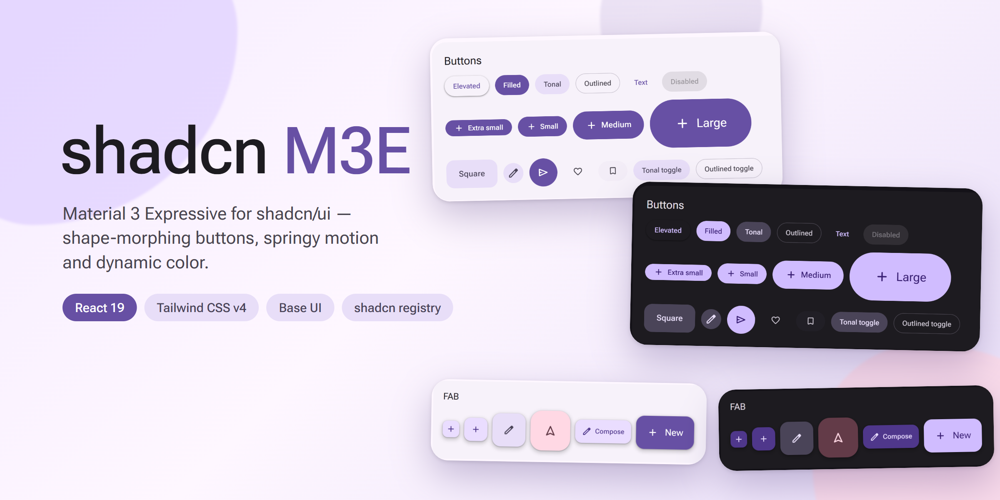

<p align="center">
  
</p>

<p align="center">
  <a href="https://github.com/Crysta1221/shadcn-m3e/stargazers"></a>
  <a href="LICENSE"></a>
  <a href="https://github.com/sponsors/Crysta1221"></a>
  
</p>

# shadcn M3E

shadcn/ui components rebuilt in the style of Material 3 Expressive (M3E): the sizes, shapes, colors, motion and typography all follow the M3E spec. Built with React 19, Tailwind CSS v4 and Base UI.

The components are distributed as a shadcn registry (`@m3e/<name>`). This repository holds both the component source and the documentation site. For installation instructions and the full component list, see the docs.

**Docs:** https://shadcn-m3e.crystaworld.dev

## Running this repository

You need [bun](https://bun.sh) (version 1.4.2, pinned in `devEngines`).

```bash
bun install
bun run dev
```

`bun run dev` builds the registry and then starts the docs site at http://localhost:5173.

Other useful scripts:

```bash
bun run typecheck       # type-check without emitting files
bun run lint            # lint with oxlint
bun run format          # format with oxfmt
bun run registry:build  # generate the registry files in public/r
bun run gen:icons       # re-bundle the icons used by the components
bun run build           # type-check, then build the docs site
```

## Directory structure

A bun workspace.

| Path                          | Contents                                                    |
| ----------------------------- | ----------------------------------------------------------- |
| `packages/m3e/src/components` | All M3E components (each one is published as `@m3e/<name>`) |
| `packages/m3e/src/lib`        | Shared library code, such as color schemes and shapes       |
| `packages/m3e/src/styles`     | Design tokens and Tailwind utilities                        |
| `packages/m3e/scripts`        | Scripts for tokens, the registry and icons                  |
| `apps/docs`                   | The documentation site; it also serves the registry         |
| `apps/docs/public/r`          | Generated registry output (not tracked by git)              |
| `apps/canvas`                 | The Playground (a subtree of lnkiai/m3e-canvas)             |

Development conventions are described in [AGENTS.md](AGENTS.md).

## Notice

This project includes work derived from other projects. See [NOTICE](NOTICE) for the attributions and licenses.

## License

[MIT](LICENSE) © 2026 Crysta1221
